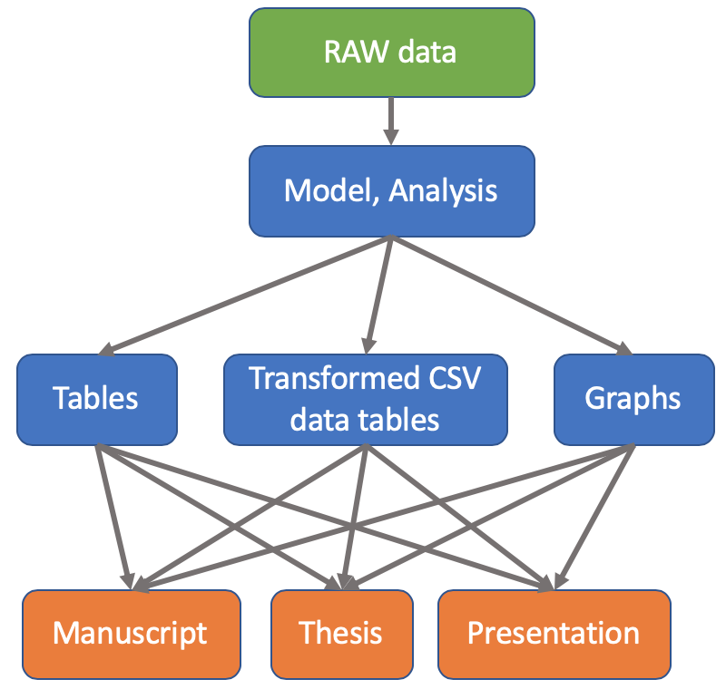

# example-Powerpoint

 Examples on how to use R to generate Powerpoint presentations
 
## Goal

The underlying model of scientifically reproducible data is to have three layers:

- RAW data that is collected
- model and analysis of the RAW data to transform
- write reports, presentations, manuscripts, and theses



# Powerpoint Presenation

First step, create a new presentation in **R Markdown** and select PowerPoint, which will generate a `Rmd` file with `output: powerpoint_presentation`, see [example of presentation](example-Presentation.Rmd)


## Images

You can include images in the Powerpoint using the markdown commands.


## Template

Use a Powerpoint template and reference the file in with the output command in the header. In this example, we will use [](ppt-template.pptx)

```Rmd
---
title: "example-Presentation"
author: "Thomas Gredig"
date: "11/28/2019"
output: 
  powerpoint_presentation:
    reference_doc: ppt-template.pptx
---
```