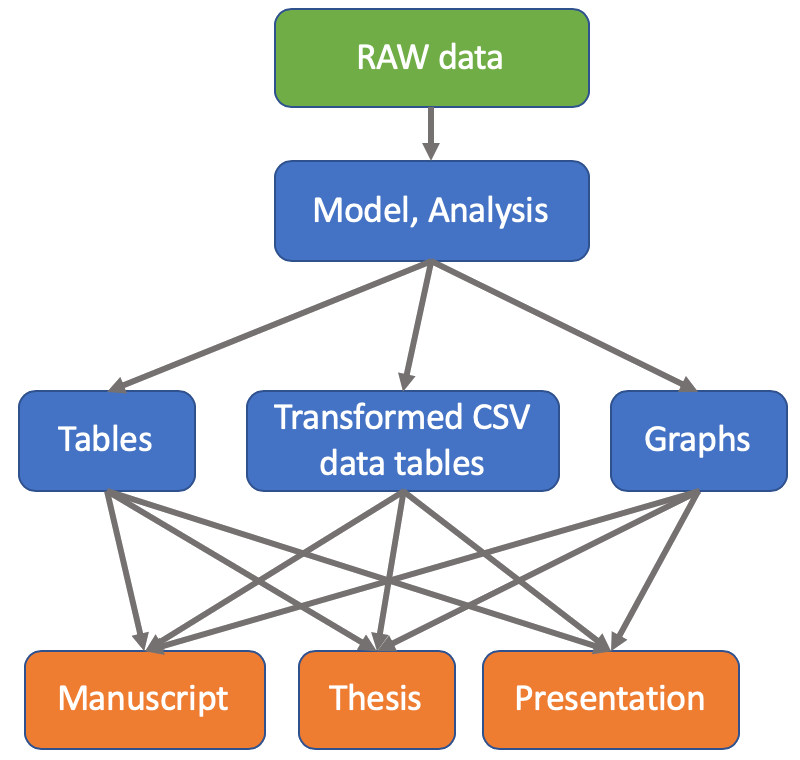

# example-Powerpoint

 Examples on how to use R to generate Powerpoint presentations
 
## Goal

The underlying model of scientifically reproducible data is to have three layers:

- RAW data that is collected
- model and analysis of the RAW data to transform
- write reports, presentations, manuscripts, and theses

# Powerpoint Presenation

First step, create a new presentation in **R Markdown** and select PowerPoint, which will generate a `Rmd` file with `output: powerpoint_presentation`.

## Images

You can include images in the Powerpoint.